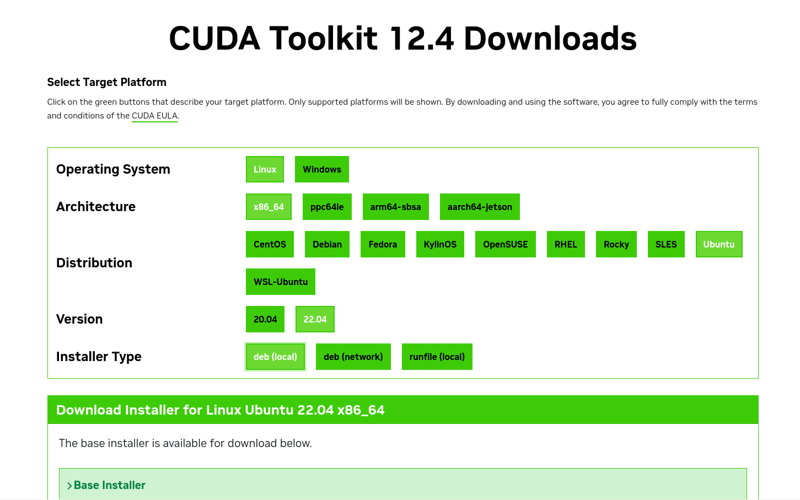

## Ubuntu Deep Learning System Setup Guide: 
### CUDA, CuDNN, NVIDIA Driver, and PyTorch
by A F M Mahfuzul Kabir, \
Machine Learning Engineer, \
ACI Limited

## How to use this document:
This document has four parts. \
1. NVIDIA Driver Installation.
2. CUDA Installation.
3. CuDNN Installation.
4. Install Python, PyTorch, and necessary libraries.

Everything is centred around Ubuntu, because, lets agree that we developers don't feel comfortable with Windows and Mac is just a bit too expensive for us. :')

Once you're done setting up Ubuntu on your local or cloud server, follow the following processes. You can find many systems online automatically set up with all driver libraries. But, it's always better to do this on your own so you don't face unexpected errors.

**READ THE DOCUMENT CAREFULLY BEFORE RUNNING ANY COMMAND**

## First Install the NVIDIA Driver.
First of all, if you installed Ubuntu with third party drivers enabled, you can skip this step. Only check the existing NVIDIA version for your device.

Check if GPU is compatible and if it has previously installed NVIDIA
```
### to verify your gpu is cuda enable check
lspci | grep -i nvidia

## check previously installed NVIDIA version
modinfo nvidia | grep ^version
```

You can check for recommended versions of NVIDIA driver with the following command.
```
ubuntu-drivers devices
```

If you have a previously installed version of NVIDIA and need to uninstall it (often specific CUDA versions require specific versions of NVIDIA drivers, and your need might require you to reinstall NVIDIA), remove it with the followig code:
```
# Remove existing installations of NVIDIA driver

sudo apt purge nvidia* -y
sudo apt remove nvidia-* -y
sudo rm /etc/apt/sources.list.d/cuda*
sudo apt autoremove -y && sudo apt autoclean -y
```

Install NVIDIA driver. In the place of 550, replace your desired version
```
## install NVIDIA driver (specific version). Here, I'm installing it for 550
sudo apt update && sudo apt upgrade -y
sudo apt install gcc
sudo add-apt-repository ppa:graphics-drivers/ppa
sudo apt update
sudo apt install libnvidia-common-550 libnvidia-gl-550 nvidia-driver-550 -y
```

In the place of 550, replace if you need other versions. Reboot and check if the NVIDIA installation is done. Run ```nvidia-smi``` to check. It should show you device information as well as versions.

## CUDA Installation
Perhaps the most confusing and difficult part of the installation process. Follow carefully.

The best way to install CUDA without any problem is from the official website. The webpage is different for each versions. Like, for CUDA 12.4 the webpage is: <a href = "https://developer.nvidia.com/cuda-12-4-0-download-archive?target_os=Linux">[Link]</a> and for the latest CUDA (currently 12.6), the webpage is: <a href = "https://developer.nvidia.com/cuda-downloads?target_os=Linux">[Link]</a>.

You have to carefully select which CUDA version you need. Many libraries or models or architectures require specific versions of CUDA. Make sure you're using the most compatible version according to your need. 

If you don't have any specific need, run ```nvidia-smi``` and look for ```CUDA Version:``` on top right. You can install the version shown here. For me, it's **12.4**, so I will show you installation for this.

Once you know the CUDA version you need, simply search Google to find the webpage as needed. You should find a webpage like the image below. Select the OS, arch, and distribution information.



Then, run the commands shown in the following parts of the webpage. For me the commands are given below:

```
wget https://developer.download.nvidia.com/compute/cuda/repos/ubuntu2204/x86_64/cuda-ubuntu2204.pin

sudo mv cuda-ubuntu2204.pin /etc/apt/preferences.d/cuda-repository-pin-600

wget https://developer.download.nvidia.com/compute/cuda/12.4.0/local_installers/cuda-repo-ubuntu2204-12-4-local_12.4.0-550.54.14-1_amd64.deb

sudo dpkg -i cuda-repo-ubuntu2204-12-4-local_12.4.0-550.54.14-1_amd64.deb

sudo cp /var/cuda-repo-ubuntu2204-12-4-local/cuda-*-keyring.gpg /usr/share/keyrings/

sudo apt-get update

sudo apt-get -y install cuda-toolkit-12-4
```

Notice, the distribution ad architecture info is embedded in the links as ```ubuntu2201``` and ```x86_64```. The cuda version is in the third command as ```12.4.0```, and the driver version is also stated as ```550.54.14```. Make sure these align with the driver and CUDA versions you extracted before. Specially, the driver version.

Note: My driver version was ```550.120``` and I installed ```550.54.14```, it didn't cause a problem. However, I did face problem with ```535```. So, make sure at least the first part of your version is aligned. You can modify the code as needed for your own implementation, but the best way is to follow the official instructions.

Once you have done installing, run the following codes to add CUDA to your system environment.
```
echo 'export PATH="/usr/local/cuda-12.2/bin${PATH:+:${PATH}}"' >> ~/.bashrc
echo 'export LD_LIBRARY_PATH="/usr/local/cuda-12.2/lib64${LD_LIBRARY_PATH:+:${LD_LIBRARY_PATH}}"' >> ~/.bashrc
source ~/.bashrc
sudo ldconfig
```

Run ```nvcc -V``` to confirm installation. It should show you the CUDA version installed. You should see something like this:
```
nvcc: NVIDIA (R) Cuda compiler driver
Copyright (c) 2005-2024 NVIDIA Corporation
Built on Tue_Feb_27_16:19:38_PST_2024
Cuda compilation tools, release 12.4, V12.4.99
Build cuda_12.4.r12.4/compiler.33961263_0
```

Congratulations, you are done installing CUDA.

## CuDNN Intallation
Once you're done installing CUDA, you'll be needed to install CuDNN. Just like CUDA, follow the official instructions. You can follow this link for the instructions: <a href = "https://developer.nvidia.com/cudnn-downloads?target_os=Linux">[Link]</a>.

Or run the code below. Make sure you adjust the OS, distribution, and architecture as before.

```
wget https://developer.download.nvidia.com/compute/cudnn/9.6.0/local_installers/cudnn-local-repo-ubuntu2204-9.6.0_1.0-1_amd64.deb

sudo dpkg -i cudnn-local-repo-ubuntu2204-9.6.0_1.0-1_amd64.deb

sudo cp /var/cudnn-local-repo-ubuntu2204-9.6.0/cudnn-*-keyring.gpg /usr/share/keyrings/

sudo apt-get update
```

After these steps, run either of the following commands to install CuDNN for CUDA 11 or CUDA 12. These days, most systems require CUDA 12, but it depends on which CUDA version you installed previously.

```
# For CUDA 11:
sudo apt-get -y install cudnn-cuda-11
# For CUDA 12:
sudo apt-get -y install cudnn-cuda-12
```

Check installation with ```cat /usr/include/x86_64-linux-gnu/cudnn_version_v9.h ```.

## Python, PyTorch Installation
Next, install Python. Ubuntu always have a specific Python version preinstalled in the system, but you might need other versions. For this, we use the ```deadsnake``` repository to install Python. Add this repository to your system first:
```
sudo apt update
sudo add-apt-repository ppa:deadsnakes/ppa
```
Now, you can simply install your desired version of Python. Make sure to install ```python-dev``` and ```python-venv``` as well, since you'll deffinitely need them for development.
```
sudo apt-get install python3.9 python3.9-dev python3.9-venv
```
In place of ```3.9``` replace your desired Python version. You can create new Python virtual environment with ```python3.9 -m venv my_venv``` and activate it ```source my_venv/bin/activate```. Make sure to activate the environment before installing torch.

Once you're done installing all prequisites (check all versions to see if working), you can install PyTorch and other necessary libraries. Follow the guide in this link: <a href="https://pytorch.org/get-started/locally/">[Link]</a>. Make sure to select proper version of CUDA according to your installation. For example, CUDA 12.1 download link is:

```
pip3 install torch torchvision torchaudio --index-url https://download.pytorch.org/whl/cu121
```
whereas CUDA 11.8 is:
```
pip3 install torch torchvision torchaudio --index-url https://download.pytorch.org/whl/cu118
```
The links are same except for the ```cu<version>``` part at last. Make sure to use the CUDA version your system has, or PyTorch will install but fail to run.

If you have the latest CUDA version, simply run ```pip3 install torch torchvision torchaudio```.

### That's it. You're done and ready for Deep Learning developments with NVIDIA and CUDA.

## Don't forget to leave a **STAR** if you found this helpful.